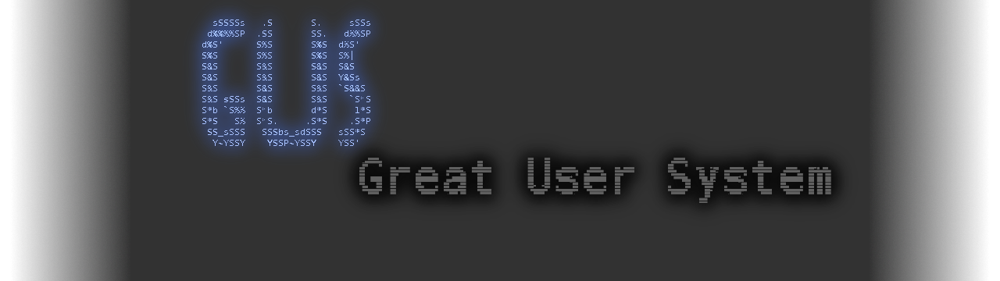

---

# Great User System (GUS)

[](https://www.rust-lang.org/)
[](https://www.gnu.org/licenses/gpl-3.0)
[]()
[]()
[]()
[]()
[]()
[](https://t.me/GreatUserSystem)

---

### Description

**GUS (Great User System)** is an operating system made for people, not programmers.  
Built in **latest Rust**, GUS combines memory safety, modern design, and simplicity.  
It aims for **modularity** and **low system requirements** — no bloat, no unnecessary complexity.  
Just works. For everyone.

> **⚠️ Beta notice:** GUS is currently in beta. Expect occasional bugs and active development. Your feedback helps us improve!

---

### Comparison

| Feature               | FreeBSD | GUS     | Linux   | Windows |
|-----------------------|---------|---------|---------|---------|
| Kernel size (approx)  | Large   | Tiny    | Medium  | Huge    |
| Open source           | ✅ Yes  | ✅ Yes  | ✅ Yes  | ❌ No   |
| Complexity for user   | High    | Low     | Medium  | Medium  |
| Popularity            | Low     | Growing | High    | High    |
| Built in Rust         | ❌ No   | ✅ Yes  | ❌ No   | ❌ No   |
| Modular by design     | Partial | ✅ Yes  | Partial | ❌ No   |
| Requires coding skills| Often   | No      | Sometimes| No     |

---

### How to build

```bash
# Clone the repository
git clone https://github.com/GreatUserTeam/GUS.git
cd GUS
./install_depends
cargo build --release
```

**Requirements:**
- Rust latest (nightly recommended)
- Rustup
- 64MB RAM minimum

---

### How to contribute

1. Fork the repository
2. Create a feature branch (`git checkout -b feature/amazing`)
3. Commit your changes (`git commit -m 'Add amazing thing'`)
4. Push to the branch (`git push origin feature/amazing`)
5. Open a Pull Request

Or just write to us in Telegram ;)

**Contribution rules:**
- Code must be written in **Rust**
- No unsafe blocks unless absolutely necessary
- Keep modules independent and small
- Update tests and docs

### Community

- **Telegram:** [@gus_system](https://t.me/GreatUserSystem)
- **Issues:** [GitHub Issues](https://github.com/GreatUserTeam/GUS/issues)

> GUS — for people, by people.
